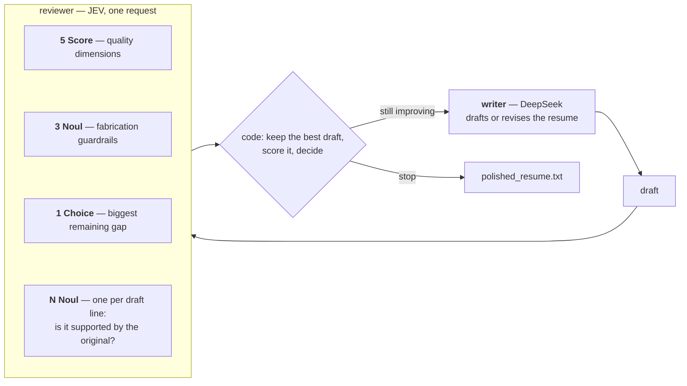

# Resume Polisher — DeepSeek writes, JEV judges

An iterative resume polisher built on the [TypeSafe AI](https://typesafe.ai) System One API.
An LLM writes; **JEV reviews, scores, and fact-checks** every draft against the original
resume; ordinary code owns the loop, the scoring, and the stop decision.

```
resume.txt + job_description.txt  ->  polished_resume.txt
```

## How a round works



Everything JEV knows about a draft arrives in **one request per round** — questions are
evaluated in parallel, so the line-by-line audit costs question tokens and almost no
extra latency.

## JEV's job

| Role | Primitive | What it returns |
|---|---|---|
| **Scorer** | 5 × `Score` (0–4 rubrics) | `jd_alignment`, `evidence_quality`, `jd_keyword_coverage`, `clarity_structure`, `impact_ownership` |
| **Guardrail** | 3 × `Noul` | `invents_metrics`, `invents_facts`, `inflates_scope` — probability the draft added something the original resume does not support |
| **Guardrail** | 1 × `Noul` per draft line | probability that line is grounded in the original resume |
| **Reviewer** | 1 × `Choice` | `biggest_gap` — which dimension to fix next |

Code turns those judgments into two numbers:

```
quality          = Σ weight × score / 4                       # weights live in judge.py
fabrication_risk = max(worst guardrail, 1 − mean line grounding, weakest unsupported line)
overall          = quality × (1 − fabrication_risk)           # grounding is a gate, not a nudge
```

A draft that is polished but invented scores low, so the loop never settles on one. The
weakest line counts at full strength once it drops below the support floor, because a
mean over twenty lines would let one invented claim hide among nineteen grounded ones.

## The loop

1. The writer drafts (round 1) or revises the **best draft so far**, given JEV's feedback:
   per-dimension scores with the rubric level each one sits at and what the level above
   asks for, the lines whose grounding is weakest (quoted, with probabilities), the biggest
   gap, the attempt history, and the phrasings JEV rejected in losing attempts — so it does
   not walk back into a worse draft or reuse wording that failed.
2. JEV scores the draft, runs the fabrication checks across it, and audits its lines.
   A line that survived the revision unchanged keeps the verdict it already earned: it is
   not asked again, which saves input tokens and keeps its verdict from jittering, so score
   movement comes from what actually changed.
3. Code keeps the highest `overall` draft and goes again. A round whose draft comes back
   unchanged is not reviewed at all — the score cannot move — so it is recorded as a flat
   round and counted towards the stop rule.

It stops when either happens:

- **no meaningful improvement** — no round beat the best draft by `min_improvement`
  (default `0.02`) for `patience` consecutive rounds (default `2`), because the writer is
  stochastic and one bad round is not a plateau;
- **max iterations** — 10 rounds by default;
- or earlier, when the draft reaches `target_score` (default `0.90`) without being blocked
  on grounding.

`polished_resume.txt` is always the best draft from the rounds that ran, never the last one.

## Requirements

- Python 3.14+ and [uv](https://docs.astral.sh/uv/)
- A [TypeSafe API key](https://console.typesafe.ai/keys) — JEV, the reviewer
- A [DeepSeek API key](https://platform.deepseek.com/) — the writer

## Setup

```bash
uv sync
```

Create `secrets.toml` (git-ignored):

```toml
[typesafe]
api_key = "YOUR_TYPESAFE_KEY"
# model = "jev-latest"          # optional

[deepseek]
api_key = "YOUR_DEEPSEEK_KEY"
# model = "deepseek-flash"      # optional
# base_url = "https://api.deepseek.com"

[polish]                        # all optional
# max_iterations = 10
# min_improvement = 0.02
# target_score = 0.90
# patience = 2
# request_timeout = 120.0        # seconds to wait on one model call
# max_retries = 2                # retries per call on a provider error or timeout
```

## Run

```bash
uv run main.py
uv run main.py path/to/resume.txt path/to/job_description.txt --out polished_resume.txt
```

The defaults are the files in `example/` (``resume.txt``, ``job_description.txt``,
``polished_resume.txt``); replace them with your own, or pass paths.

Each round prints its dimension scores, guardrail probabilities, the lines JEV could not
support, and the biggest gap. The run ends with the winning round and a token/latency total.

| Flag | What it does |
|---|---|
| `--port N` | port for the report page (default `8765`) |
| `--no-serve` | skip the page and just run the loop |
| `--report-json PATH` | write the run payload for later, or for another tool |
| `--serve-report PATH` | skip the run and serve a payload written earlier |
| `--max-iterations N` | override the round ceiling |
| `--secrets PATH` | a different secrets file |

`example/resume.txt` and `example/job_description.txt` are **sample inputs**, and
`example/polished_resume.txt` is a sample of what a run produces; replace them with your
own.

## Report page

Every run serves a live page at `http://127.0.0.1:8765`. Rounds appear as they finish,
so a long run can be watched instead of scrolled.

- **Versions** — the original plus every round, each with its overall score.
- **Undo / Next** — step through the versions, with `←` and `→`; the timeline chips do
the same. The page follows the newest round until you navigate.
- **Diff** — the selected version against the previous one, or against the original
(`c` toggles). `h` hides unchanged lines and keeps the markers where they were skipped.
- **JEV scores** — the five dimensions with the delta against the previous version, the
reviewer's confidence, the three fabrication checks, line grounding, the weakest line, the
biggest gap, and any lines the reviewer could not support.
- **Save this version** — writes the selected version to the output file, which is how you
keep a round the loop did not pick. The button is disabled while the run is live, because
the loop owns that file and rewrites it whenever a round becomes the new best.

The page is a view over one payload (`build_report`), which is also what `--report-json`
writes and what the console prints, so the terminal and the browser cannot disagree.

## Project structure

```
main.py             `uv run main.py` — a two-line entry point
example/            sample inputs and a sample output; replace with your own
polisher/
  config.py         secrets.toml, the loop's knobs, the input files
  writer.py         DeepSeek: the system prompt, prompt assembly, draft cleanup
  judge.py          JEV: dimensions, weights, guardrails, per-line audit, composite score
  loop.py           writer -> judge -> keep the best -> repeat; the stop rules
  metrics.py        per-call latency and token records
  diff.py           line diffs between versions, for both views
  report.py         the single run payload every view reads
  console.py        the terminal view
  page.py           the HTML view
  server.py         the local server: the page, the payload, and saving a version
  cli.py            argument parsing and the wiring between all of the above
```

The loop is pure orchestration: it makes the two calls per round and hands each finished
round to an observer. Printing, file writing, and the page are observers, which is why the
loop can be tested with no API keys.

## Tuning

- **Weights** — `WEIGHTS` in `judge.py`. Code, not prompts: retune without rerunning inference.
- **Rubrics** — `DIMENSIONS` and `GUARDRAILS` in `judge.py`. Every level describes the
  resume's treatment of the candidate's real evidence, so a better rewrite can always move
  the score; a level no honest rewrite can reach would freeze the loop.
- **Strictness** — `LINE_SUPPORT_FLOOR`, `LINE_REVIEW_FLOOR`, `FABRICATION_BLOCK`, and
  `CONFIDENCE_FLOOR` in `judge.py`.
- **Patience and timeouts** — `[polish]` in `secrets.toml`. `patience` decides how many
  flat rounds are tolerated before stopping, and `request_timeout` / `max_retries` bound
  one model call so a stalled provider cannot hang the loop.
- **Writer policy** — `SYSTEM_PROMPT` in `writer.py`. It carries the rules that matter
  most in practice: never claim authority the original resume does not give (`own`, `led`,
  `drove`), never leave a bullet as a duty (`responsible for`, `involved in`, `helped
  with`) — say what the candidate did instead — and never reword a line the reviewer has
  already accepted, so a round is not spent on cosmetic edits.
- **Writer behavior** — `TEMPERATURE` in `writer.py`.

## Linting

```bash
uv run ruff check .
uv run ruff format .
```
