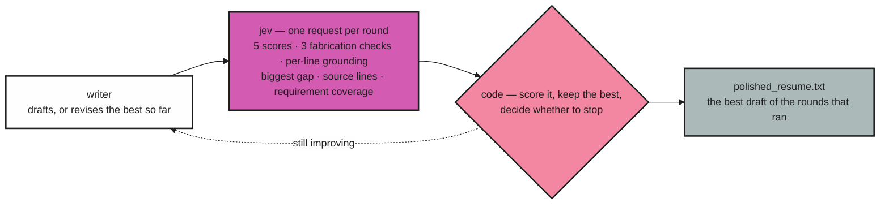

# Resume Polisher

`deepseek writes · jev judges · code decides`

[](LICENSE)
[](#quickstart)
[](docs/architecture.md#tests)
[](https://typesafe.ai)
[](docs/configuration.md)

An iterative resume polisher built on the [TypeSafe AI](https://typesafe.ai) System One API.
A model writes; **JEV reviews, scores, and fact-checks** every draft against the original
resume; ordinary code owns the loop, the scoring, and the stop decision.

```
resume.txt + job_description.txt  ->  polished_resume.txt
```


*Every run serves this page, in the order a decision is made: the score, the lines that need
a person, the draft, then the dimensions, fabrication checks, grounding ledger, requirement
coverage, and cost. Here the first pass scores 0.20 because grounding gates the score —
quality 0.61 × grounded 0.32 — one line has no source in the original, and the diff shows the
original line for the one it does. The later rounds on the timeline carry 19 of 20 audited
lines over rather than re-asking them.*

Three colours carry three readings, everywhere they appear: **sage** for grounded, answered
and carried, **magenta** for scored and uncertain, **pink** for unsupported, blocked and
waiting on a person. A run that grounded everything turns the page quiet; a run with a line
nobody can source turns the places that need a decision pink.

## quickstart

Python 3.14+ and [uv](https://docs.astral.sh/uv/). If you run the browser tests or check the
embedded page script locally, use Node 24 (`nvm use` reads `.nvmrc`). Two keys:
[TypeSafe](https://console.typesafe.ai/keys) for JEV (the reviewer) and
[DeepSeek](https://platform.deepseek.com/) for the writer.

```bash
uv sync
```

`secrets.toml` (git-ignored) — the keys are the only required settings:

```toml
[typesafe]
api_key = "YOUR_TYPESAFE_KEY"

[writer]                  # any OpenAI-compatible provider
api_key = "YOUR_DEEPSEEK_KEY"

[polish]                  # optional: max_iterations, min_improvement, target_score,
                          # patience, request_timeout, max_retries
```

Then run it; the defaults are the sample files in `example/`, and every flag below works as
`uv run main.py …` or the installed `resume-polisher` (`uv tool install .`):

```bash
uv run main.py
uv run main.py path/to/resume.txt path/to/job_description.txt --out polished_resume.txt
uv run main.py path/to/resume.txt path/to/job_description.txt --rules customer-rules.toml
```

The run serves the report page and **opens it in your browser**; the terminal keeps a
one-line-per-round log. Every flag, the loop's knobs, and the writer's options are in
[configuration](docs/configuration.md).

## verdict

`quality × (1 − fabrication risk)` · grounding is a gate, not a nudge

```
quality          = Σ weight × score / 4                       # weights live in judge.py
fabrication_risk = max(worst guardrail, 1 − mean line grounding, weakest unsupported line)
overall          = quality × (1 − fabrication_risk)
```

A draft that is polished but invented scores low, so the loop never settles on one. The weakest
line counts at full strength once it drops below the support floor — a mean over twenty lines
would let one invented claim hide among nineteen grounded ones.

Beside the number, the page keeps the run's trust strip: lines audited, lines carried rather
than re-asked, unsupported, uncertain, low-confidence dimensions, and the weakest line.

## needs a decision

`the only band that needs a person`

Every line the reviewer could not ground, with its probability, its failing claim, and
**Approve** / **Reject**. A rejection is appended to `audit.jsonl` and fed back to the writer,
so a phrasing a person rejected cannot return. A run whose winner still has ungrounded lines
writes `UNRESOLVED.md` instead of a clean artifact.

The page is where a run is read and steered — [the report page](docs/report-page.md) covers
every window on it.

## draft

`writer → jev → code, one round at a time`



1. **Writer** — drafts (round 1) or revises the best draft so far, given JEV's per-dimension
   scores with the rubric level each sits at and what the level above asks for, the
   weakest-grounded lines quoted with their probabilities, the biggest gap, the requirements
   left unanswered (named so they are left out, not invented), the attempt history, and every
   phrasing JEV or a human already rejected.
2. **JEV** — scores the draft, runs the fabrication checks, and audits its lines.
3. **Code** — keeps the highest `overall` and repeats. A draft that comes back unchanged is not
   reviewed at all (the score cannot move); it counts as a flat round towards the stop rule.

It stops on `target_score` (0.90), on the round ceiling (10 rounds), or on a plateau — no gain of
`min_improvement` (0.02) for `patience` (2) rounds. `polished_resume.txt` is always the best
draft of the rounds that ran, never the last one.

The diff links each bullet to the original line that supports it, and says plainly when nothing
does. [How it works →](docs/how-it-works.md)

## dimensions

`weighted mean, each scored against a level of 4`

| Dimension | Weight | |
|---|---|---|
| `jd_alignment` | 0.30 | `██████████` |
| `evidence_quality` | 0.25 | `████████░░` |
| `jd_keyword_coverage` | 0.20 | `███████░░░` |
| `clarity_structure` | 0.15 | `█████░░░░░` |
| `impact_ownership` | 0.10 | `███░░░░░░░` |

## fabrication checks

`a draft is blocked at 0.50`

`invents_metrics` · `invents_facts` · `inflates_scope` — the probability the draft added
something the original resume does not support. Per line, and per clause of a multi-clause line,
JEV also answers whether it is grounded at all: **supported** (≥ 0.80), **uncertain**
(0.50–0.80), **unsupported** (< 0.50).

## grounding ledger

`audited · carried · uncertain band 0.50–0.80`

Every audited line with the probability it is grounded and the atomic claims inside it, the claim
that dragged it down marked rather than left for the reader to find. Filter to *needs attention*,
*uncertain*, or *unsupported*.

## requirement coverage

`answered of asked`

Each job requirement against the draft line that answers it, with the gaps left visibly empty. An
uncovered requirement is an instruction to leave it out, not to invent it.

## run totals

`tokens, seconds, and the reviewer's share`

Tokens and seconds by writer and reviewer, the reviewer's share of the bill, the budget meter
under `--max-tokens` / `--max-seconds`, and cost per round. Every run writes `runs/<run-id>/`
(`manifest.json`, `round-<n>.json`, `audit.jsonl`), the winner to `--out`, and `UNRESOLVED.md`
instead of a clean artifact whenever the winner still has ungrounded lines.
[`--resume`, `--purge`, and batch mode →](docs/runs.md)

## where to read more

| Doc | Answers |
|---|---|
| [How it works](docs/how-it-works.md) | the round, JEV's questions, the two numbers, the stop rules |
| [The report page](docs/report-page.md) | every window, the keys, the states, editing, saving, decisions |
| [Runs and batch](docs/runs.md) | run directories, outputs, `--resume`, batch mode, exit codes |
| [Configuration](docs/configuration.md) | `secrets.toml`, all 18 flags, the loop's knobs, the tuning knobs |
| [Architecture](docs/architecture.md) | modules, the observer pattern, tests, packaging |
| [Data flow](docs/data-flow.md) | exactly what leaves the machine, and to whom |
| [Roadmap](docs/roadmap.md) | what is next: the rulebook, the page, and the numbers worth trusting |

## privacy

`a resume is personal data`

A resume is sent to two third parties. [Data flow](docs/data-flow.md) lists exactly what leaves
the machine and to whom; `--redact` strips email, phone, address, and links before any request,
and `--no-store` writes nothing to disk at all.

The page listens on `127.0.0.1` with no login and can read the payload and write the output file,
so `--host 0.0.0.0` exposes a resume to anyone who can reach the port.

## license

MIT. See [LICENSE](LICENSE).
