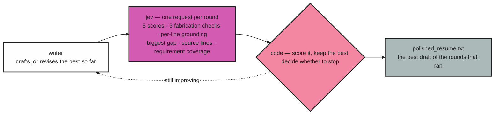

# How it works

`writer → jev → code` · one reviewer request per round

A model writes, JEV judges, and ordinary code owns the loop, the scoring, and the stop
decision. Nothing in the run depends on the writer grading its own work.



Everything JEV knows about a draft arrives in **one request per round** — the questions are
evaluated in parallel, so the line-by-line audit costs question tokens and almost no extra
latency.

## jev's job

| Role | Primitive | What it returns |
|---|---|---|
| **Scorer** | 5 × `Score` (0–4 rubrics) | `jd_alignment`, `evidence_quality`, `jd_keyword_coverage`, `clarity_structure`, `impact_ownership` |
| **Guardrail** | 3 × `Noul` | `invents_metrics`, `invents_facts`, `inflates_scope` — probability the draft added something the original resume does not support |
| **Guardrail** | 1 × `Noul` per draft line, and 1 per clause of a multi-clause line | probability that line, or that clause, is grounded in the original resume |
| **Reviewer** | 1 × `Choice` | `biggest_gap` — which dimension to fix next |
| **Evidence** | 1 × `Choice` per draft line | which of the original's lines (chosen in code by word overlap) is the source, or none |
| **Coverage** | 1 × `Choice` per job requirement | which draft line answers it, or none |

## the two numbers

```
quality          = Σ weight × score / 4                       # weights live in judge.py
fabrication_risk = max(worst guardrail, 1 − mean line grounding, weakest unsupported line)
overall          = quality × (1 − fabrication_risk)           # grounding is a gate, not a nudge
```

| Dimension | Weight | |
|---|---|---|
| `jd_alignment` | 0.30 | `██████████` |
| `evidence_quality` | 0.25 | `████████░░` |
| `jd_keyword_coverage` | 0.20 | `███████░░░` |
| `clarity_structure` | 0.15 | `█████░░░░░` |
| `impact_ownership` | 0.10 | `███░░░░░░░` |

Each dimension is scored against a level of 4. A draft that is polished but invented scores
low, so the loop never settles on one. The weakest line counts at full strength once it drops
below the support floor — a mean over twenty lines would let one invented claim hide among
nineteen grounded ones.

## the loop

1. **Writer** — drafts (round 1) or revises the best draft so far, given JEV's per-dimension
   scores with the rubric level each sits at and what the level above asks for, the
   weakest-grounded lines quoted with their probabilities, the biggest gap, the requirements
   left unanswered (named so they are left out, not invented), the attempt history, and every
   phrasing JEV or a human already rejected.
2. **JEV** — scores the draft, runs the fabrication checks, and audits its lines.
3. **Code** — keeps the highest `overall` and repeats. A draft that comes back unchanged is not
   reviewed at all (the score cannot move); it counts as a flat round towards the stop rule.

## when it stops

- **target reached** — the draft reached `target_score` (default `0.90`) without being blocked
  on grounding;
- **round ceiling** — `max_iterations` rounds (default 10);
- **plateau** — no round beat the best by `min_improvement` (default `0.02`) for `patience`
  consecutive rounds (default 2). One bad round is not a plateau: the writer is stochastic.

`polished_resume.txt` is always the best draft of the rounds that ran, never the last one.

## carried verdicts

A line that survives a revision unchanged keeps the verdict it already earned. It is not asked
again, so it costs no input tokens and its verdict cannot jitter: score movement comes from what
actually changed. The verdict strip at the top of the page reports the consequence of that —
lines audited, lines carried rather than re-asked, unsupported, uncertain, and low-confidence
dimensions.

## tuning the judgment

The rubrics, weights, and floors are code, not prompts: retune them without re-running
inference. See [configuration](configuration.md#tuning).
